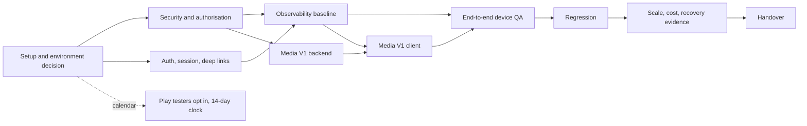

# Sprint sequence

A suggested order for the 10-calendar-day delivery window. It is not ten full-time days; the
sequence follows dependencies and the four payment milestones in the job brief, not a calendar.

## Dependency order

## Stages

| Stage | Depends on | Can run in parallel with | Outcome | Milestone |
|---|---|---|---|---|
| Setup: local build, gates, environment decision, identities | Access from `18` | Play tester chasing by the owner | Reproducible build; agreed test environment | 1 |
| Security and authorisation: reproduce HO-01 to HO-07, HO-25; fix confirmed P0 and P1 with pgTAP negatives in CI; start matrix | Setup | Auth investigation (reading only) | Findings register with reproductions; fixes as PRs; migrations with rollback scripts for the owner to apply | 1 |
| Auth, session, deep links: device runs of every provider; fix redemption failure path, callback handling, Google iOS path decision | Setup; test identities | Security fixes | Auth rows of the device matrix filled | 2 |
| Observability baseline: Sentry or approved equivalent, scrubbing, RPC error capture | Owner approval of account | Auth work | Test error visible from a release-profile build | 2 |
| Media V1 backend: table, bucket, policies, signed-URL RPC, admin upload | Security patterns settled; Media decisions in `13` answered | Auth and observability | Negative tests for media access | 3 |
| Media V1 client: audio and video players, admin screen | Media backend; the same native build as Sentry | Device QA of non-media journeys | Publish by admin, playback by member on both platforms | 3 |
| End-to-end device QA | Observability, so failures are visible | Media client | `11_DEVICE_TEST_MATRIX.csv` filled with pass or fail and defect IDs | 2 and 3 |
| Regression | All fixes merged | | Core journeys re-run after fixes | 4 |
| Scale, cost, recovery evidence | Staging or local data seeded | Regression | Plans and p50, p95, p99 from `15`; cost template filled; backup posture recorded | 4 |
| Handover | Everything | | Updated register, matrices, runbook notes, Phase 2 list | 4 |

## One native release

Sentry, `expo-audio`, `expo-video`, any background-audio configuration and any auth fixes that
touch native configuration should ship in one store build per platform, because each native
release costs a review cycle on iOS and a signed workflow run on Android. Database fixes ship
independently and first.

## Scope guard

If a stage threatens the milestone, raise it in the two-day update and move the item to Phase 2
with a written recommendation rather than extending into refactors. Profile pictures start only
after milestone 3 evidence exists.
