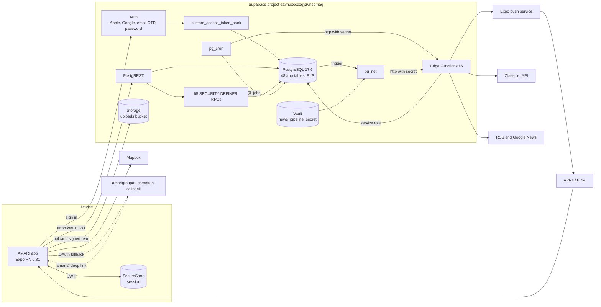
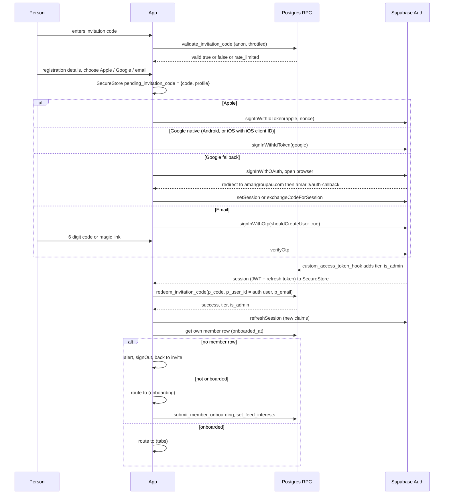
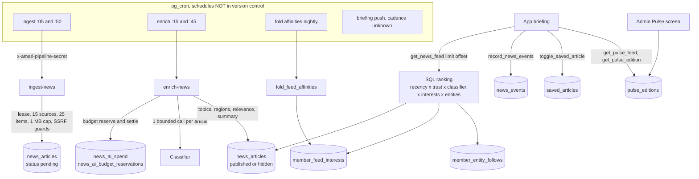
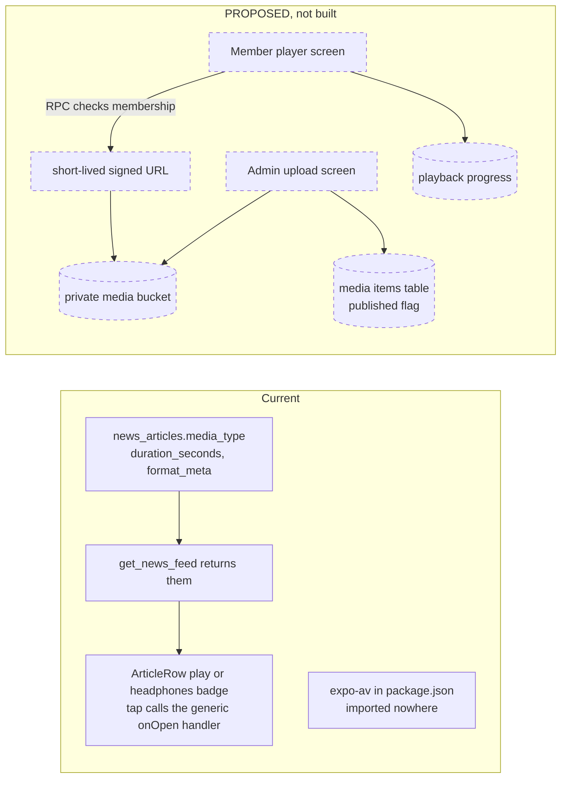
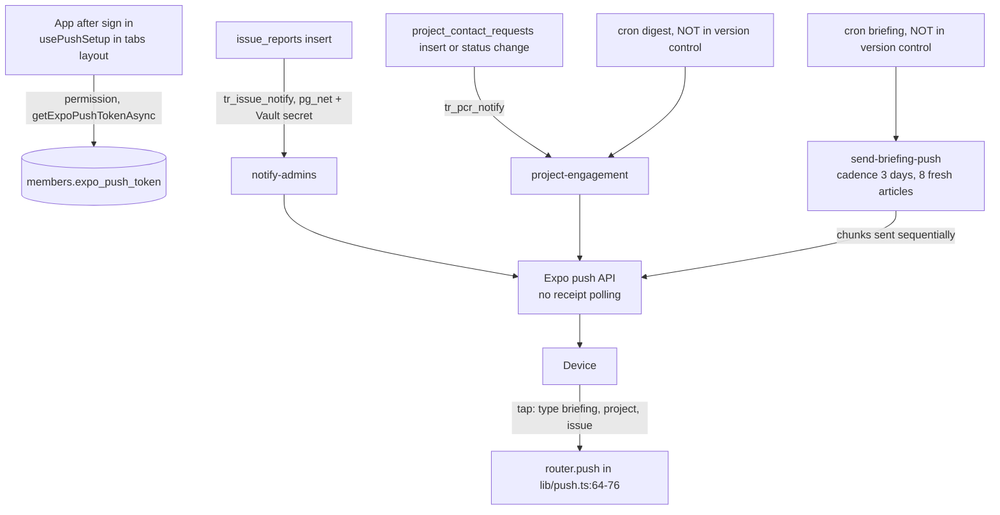
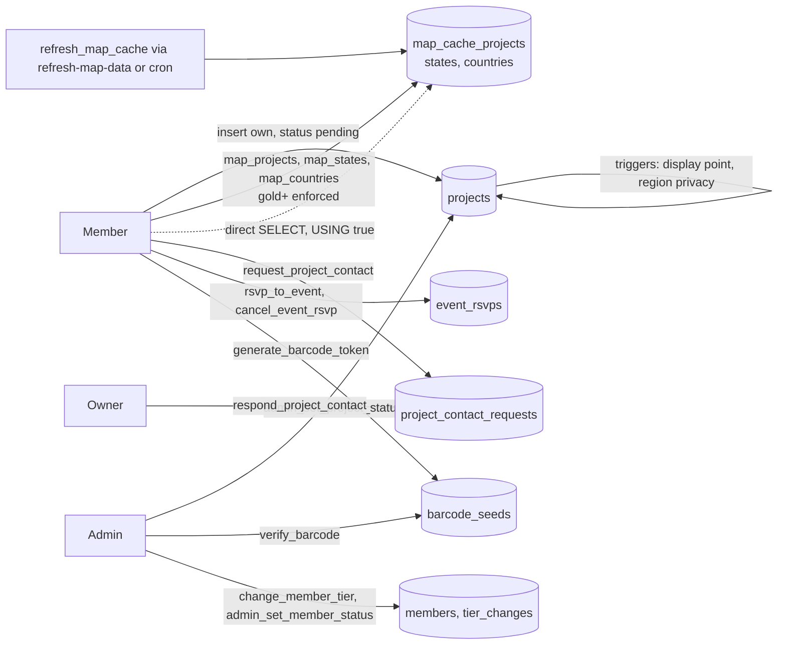

# Architecture

Commit `3ce4c4c`. The system design first, then authentication, sessions and deep links in detail.

## System

Reverse-engineered from commit `3ce4c4c`. Every box below is CURRENT IMPLEMENTATION unless it is
drawn with a dashed outline and marked PROPOSED or INCOMPLETE.

### Layers

| Layer | Implementation | Evidence |
|---|---|---|
| Mobile client | Expo SDK 54, React Native 0.81.5, expo-router 6 with typed routes, new architecture enabled | `package.json`, `app.json:9` |
| Navigation | Route groups `(auth)`, `(onboarding)`, `(tabs)`, plus `app/admin/*` stack and `app/briefing.tsx` | `app/` tree, `app/_layout.tsx:65-118` |
| Session | Supabase JS client, session persisted through an expo-secure-store adapter, auto refresh on | `lib/supabase.ts:9-39` |
| Server data | TanStack Query; `staleTime` 2 minutes, `gcTime` 5 minutes, no persister | `lib/queryClient.ts:6-7` |
| Local state | zustand where used; auth state in a React context | `providers/AuthProvider.tsx` |
| API | PostgREST over tables with RLS, and RPCs to SECURITY DEFINER functions | `supabase/migrations/` |
| Claims | `custom_access_token_hook` writes `tier` and `is_admin` into `app_metadata` at token mint | `20260301000004_auth_hook.sql:6-30` |
| Functions | Six Deno Edge Functions, none called by the mobile client | `supabase/functions/*/index.ts` |
| Scheduling | pg_cron. Four jobs in migrations; five more exist only in production or a runbook | `20260301000005_cron_jobs.sql`, `supabase/functions/NEWS-PIPELINE.md:45-95` |
| Outbound HTTP from SQL | pg_net `net.http_post` from two trigger functions, secret read from Vault | `20260710000005_project_engagement.sql:123-139`, `20260710000006_issue_reports.sql:101-110` |
| Storage | One private bucket `uploads` defined in migrations; client also writes to an undefined bucket `public` | `20260321000003_authority_hardening_v2.sql:261`, `app/admin/events.tsx:104` |
| Push | Expo push service; token stored on `members.expo_push_token` | `lib/push.ts:44-47` |
| Maps | Mapbox native SDK; download token at build time, public token in the app | `app.config.js:3-20`, `lib/mapbox.ts` |
| Classifier | Anthropic by default, OpenAI-compatible endpoint when `LLM_PROVIDER=openai` | `supabase/functions/enrich-news/index.ts:25-45` |

The 5 September report states the live classifier is GLM-5.2 through OpenRouter. The code pins
`OPENAI_MODEL = 'gpt-4o-mini-2024-07-18'` at `supabase/functions/enrich-news/index.ts:29`, and
`enrich-news/core_test.ts:80-81` asserts that an `OPENAI_MODEL` environment override is rejected so
that spend stays priced. `supabase/functions/NEWS-PIPELINE.md:34` still tells the operator to set
`OPENAI_MODEL`, which the code ignores. With `LLM_PROVIDER=openai` and `OPENAI_BASE_URL` pointed at
another provider, that provider receives the pinned model name. Which provider and model actually
run in production, and whether the budget meter prices them correctly, is EXTERNAL VERIFICATION
REQUIRED (Edge Function secrets and `news_ai_spend`).

### Third-party dependencies that matter in production

| Service | Used for | Where configured |
|---|---|---|
| Supabase | Database, Auth, Storage, Edge Functions, cron, Vault | `eas.json` env, Supabase dashboard |
| Apple | Sign in with Apple, App Store, APNs through Expo | `app.json:17-19`, `lib/appleAuth.ts` |
| Google | Google Sign-In (web, Android, iOS client IDs), Play Console | `eas.json` env, `lib/googleAuth.ts` |
| Expo / EAS | Builds, submissions, push service, update server (unused) | `eas.json`, `app.json:90-99` |
| Mapbox | Map tiles and native SDK | `app.config.js`, GitHub secret `EXPO_PUBLIC_MAPBOX_TOKEN` |
| Anthropic or OpenAI-compatible provider | Article classification | Edge Function secrets |
| Google News and publisher RSS | Article discovery | `news_sources` table, `ingest-news` |
| amarigroupau.com | OAuth and magic-link redirect page `/auth-callback` | `eas.json` `EXPO_PUBLIC_AUTH_REDIRECT_URL` |
| GitHub Actions | CI gate and the signed Android build | `.github/workflows/*.yml` |
| Email delivery for OTP | Supabase Auth mailer or custom SMTP | EXTERNAL VERIFICATION REQUIRED |
| Sentry, PostHog | Referenced by shims only; not installed | `lib/sentry.ts`, `lib/posthog.ts` |

### Overall system

### Authentication and session flow

Detailed with file references in the next section. This diagram is CURRENT IMPLEMENTATION.

### Content and news flow

### Media flow

CURRENT IMPLEMENTATION is only the left-hand column. Everything dashed is PROPOSED and does not exist.

### Push notification flow

`send-briefing-push` writes `push_log`; there is no receipt pass, so `DeviceNotRegistered` tokens are
never pruned (`supabase/functions/send-briefing-push/index.ts:112-121`).

### Project, event and member data flow

The dotted edge is the HO-01 bypass: the cache tables are readable directly by any authenticated
caller, whatever the map RPCs enforce.

### Current against proposed

| Area | Current implementation | Proposed or incomplete |
|---|---|---|
| Environments | One production project for all profiles | Staging or Supabase branching, not decided |
| Media | Schema columns and a badge | Upload, storage, access model, player: all to build |
| Observability | `console.error` via `lib/reportError.ts` | Sentry SDK, DSN, source maps |
| Cron | 4 jobs in migrations | 9 jobs in one idempotent migration |
| Account deletion | Flag and notification | Actual deletion job or staffed process |
| Corridor | Screen exists, hidden (`TAB_VISIBILITY.corridor = 99`) | Product decision |
| Profile photos | Not built | Stretch only |

## Authentication, sessions and deep links

Commit `3ce4c4c`. Authentication (who you are) and authorisation (what you may do) are kept apart
here: this file is about the first, and ends where the member row exists. Authorisation is `trackers/authorisation-matrix.csv` and
`SECURITY.md`. Each stage has a source-code observation and the device test it still needs.

### Stage by stage

#### Invite
- **Source-code observation.** Two entry points call `validate_invitation_code` with the upper-cased code: `components/v2/Onboarding.tsx:318` and `app/(auth)/invite.tsx:54`. The client imposes a minimum length of 4 and no maximum. On `rate_limited` the invite screen tells the person to wait an hour; the server window is 10 minutes. On success the code is passed as a route parameter to `/(auth)/register`.
- **Device test required.** Six-character code entry with the Crockford alphabet (no I, L, O, U); lower-case input; pasting; rate-limit message after 10 attempts; offline error.

#### Sign-up
- **Source-code observation.** `app/(auth)/register.tsx:46-60` writes `pending_invitation_code` to SecureStore as JSON containing the code and the profile fields, before any provider is called. Email sign-up validates input with zod (`lib/schemas.ts:67`) and calls `signInWithOtp` with `shouldCreateUser: true`, copying the profile into `user_metadata`.
- **Device test required.** Killing the app between provider return and redemption; returning after a magic link opened on a second device, where no pending code exists.

#### Apple
- **Source-code observation.** `lib/appleAuth.ts:11-53`. iOS only; availability checked; random nonce, SHA-256 hashed for Apple, raw nonce sent to Supabase with the identity token and authorisation code. Name and the Apple-returned email are written to `user_metadata` afterwards; Apple returns them only on first authorisation.
- **Private relay.** With Hide My Email, `state.user.email` is a `privaterelay.appleid.com` address. Redemption exempts relay addresses from recipient binding (`20260921000001:255-262`). Relay addresses are specific to the Apple developer team.
- **Device test required.** First authorisation and repeat authorisation; Hide My Email and Share My Email; revoking the app in Apple ID settings and signing in again.

#### Google
- **Source-code observation.** `lib/googleAuth.ts`. `configureGoogleSignIn()` runs at root mount (`app/_layout.tsx:425`). On iOS it returns early without configuring the native SDK when `EXPO_PUBLIC_GOOGLE_IOS_CLIENT_ID` is absent (`lib/googleAuth.ts:30-33`); `eas.json` does not set it. Then `signInWithGoogle()` uses `signInWithOAuth` with `skipBrowserRedirect`, opens `WebBrowser.openAuthSessionAsync(url, redirectTo)` where `redirectTo` is `https://www.amarigroupau.com/auth-callback` (`lib/authRedirect.ts:7-12`), and completes with `completeAuthFromUrl`. If the auth session returns neither success nor cancel, it calls `Linking.openURL(data.url)` and leaves the flow to the deep-link handler (`lib/googleAuth.ts:56-67`). On Android the native SDK signs out first to force account choice, then exchanges the ID token with `signInWithIdToken`; any native error other than cancel falls back to the browser silently (`lib/googleAuth.ts:84-97`).
- **iOS Google browser fallback.** `openAuthSessionAsync` returns success only when the browser navigates to a URL that begins with `redirectTo`. Because `redirectTo` is an `https` page on the website rather than `amari://`, the session completes only if the website page then redirects to a URL the auth session recognises. What that page does is outside this repository: EXTERNAL VERIFICATION REQUIRED. If it redirects to `amari://auth-callback#...`, the result arrives through the deep-link handler rather than the auth session, and the auth session may report dismiss, which the code turns into "Google sign-in was cancelled." while the deep-link handler sets the session. This race is the most likely source of reported Google friction on iOS.
- **Device test required.** Both paths on iOS (with and without an iOS client ID in a test build), Android with and without Google Play services, account chooser, cancellation.

#### Email
- **Source-code observation.** New members: `register.tsx:96-150`, OTP code entry or magic link with `emailRedirectTo` set to the website callback. Existing members: `invite.tsx:91-154` with `shouldCreateUser: false`. Magic links reach the app through `amari://auth-callback?token_hash=...&type=...`, handled by `lib/authCallback.ts:52-63` with `verifyOtp`.
- **Device test required.** OTP entry; magic link on the same device; magic link on a different device; expired code; deliverability (SMTP configuration is EXTERNAL).

#### Reviewer password
- **Source-code observation.** `invite.tsx:154-178`, `signInWithPassword`, toggle visible to everyone at line 427. Whether password sign-in is enabled in the Auth dashboard is EXTERNAL.

#### Session creation and redemption
- **Source-code observation.** `providers/AuthProvider.tsx:177-243`. When a user appears and post-auth setup is incomplete, the provider reads the pending code, calls `redeem_invitation_code` with `p_user_id = state.user.id` and `p_email = state.user.email`, then on success deletes the pending code, calls `refreshSession()` so the hook stamps the new tier and admin claims, and syncs empty profile fields. On `already_member` it syncs and deletes; on `invalid_or_expired` it deletes; on an RPC error it keeps the code and marks setup complete anyway.
- **Guard.** `app/_layout.tsx:65-118`: no member row triggers an alert, `signOut()` and a redirect to the invite screen.
- **Device test required.** Network loss between provider success and redemption (HO-23); redeeming a code addressed to another email (HO-05, expected refusal).

#### Secure persistence
- **Source-code observation.** `lib/supabase.ts:9-39`: the Supabase client stores its session through `expo-secure-store` (`localStorage` on web), `persistSession: true`, `autoRefreshToken: true`, `detectSessionInUrl: false`. `lib/secureStorage.ts` is a second, older token store that nothing in the auth path uses. `expo-secure-store` warns above 2 KB on Android; the session JSON with custom claims may approach that.
- **Device test required.** Measure the stored session size on Android; confirm persistence across reboot on both platforms.

#### Refresh, restart, long background, expiry
- **Source-code observation.** Supabase JS refreshes on a timer while the app is foregrounded. No `AppState` listener calls `supabase.auth.startAutoRefresh` or `stopAutoRefresh` (the only `AppState` use is dwell tracking in `app/briefing.tsx:33`), which the Supabase React Native guidance recommends, so after a long background the first requests may carry an expired access token until the client refreshes. `TOKEN_REFRESHED` invalidates several query families (`AuthProvider.tsx:81-86`). Access-token lifetime and refresh-token rotation settings are EXTERNAL VERIFICATION REQUIRED.
- **Device test required.** Background for more than the token lifetime, then resume and act; airplane mode across expiry; device clock skew.

#### Stale claims
- **Source-code observation.** Tier and admin flags in the client come from `session.user.app_metadata` (`AuthProvider.tsx:41-47`). A Realtime subscription on `notifications` for `tier_change` calls `refreshSession()` (`AuthProvider.tsx:246-268`), which depends on `notifications` being in the Realtime publication (EXTERNAL). Database checks mostly read tables, so a stale claim mainly affects which tabs show. `get_member_tier()` falls back to the claim for non-active callers (HO-08).
- **Device test required.** Change a test member's tier as admin and time how long each surface takes to reflect it; suspend a member and confirm what they can still do before and after refresh.

#### Logout and re-login
- **Source-code observation.** `SIGNED_OUT` clears the query cache (`AuthProvider.tsx:88-90`). The Expo push token is not cleared from the member row (HO-28). The SecureStore pending code is deleted at the start of existing-member email sign-in only.
- **Device test required.** Logout then sign in as a different member on the same device; check the previous member's pushes stop.

#### Recovery
- **Source-code observation.** No password reset flow exists in the client (password sign-in is reviewer-only). Members recover by signing in again with the same provider. A member who used Apple with Hide My Email on one Apple ID cannot recover through email.
- **Device test required.** Lost-device scenario for each provider.

#### Deep-link return
- **Source-code observation.** Scheme `amari` (`app.json:10`). Root handler processes `Linking.getInitialURL()` and `url` events (`app/_layout.tsx:429-445`) with `completeAuthFromUrl`, which acts on any URL containing `auth-callback`: `access_token` plus `refresh_token` go to `setSession`, `code` to `exchangeCodeForSession`, `token_hash` to `verifyOtp` (`lib/authCallback.ts:20-66`). The route `app/(auth)/auth-callback.tsx` rebuilds the query string and calls the same function again, so a single link can be processed twice; the second `verifyOtp` or code exchange will fail and the screen may show "Verification Failed" after a successful sign-in. There is no check that the app initiated the flow (HO-12).
- **Universal links and App Links.** None. `app.json` has no `ios.associatedDomains` and no `android.intentFilters`. The website callback page is the bridge.
- **Android `amari://`.** Expo registers the scheme through the generated manifest. Custom schemes on Android can be claimed by any app that declares the same scheme, and the Android chooser may appear if more than one app does. The job brief asks for a safer supported approach; App Links on a verified domain are the standard answer, which needs the website to serve `assetlinks.json` and a native build.
- **Device test required.** Magic link from Gmail and from the default mail app on each platform, cold and warm; Google fallback on iOS; an `amari://auth-callback` link with foreign tokens (expected refusal after a fix).

#### Account linking
- **Source-code observation.** No explicit linking code. Supabase Auth links identities with the same verified email automatically depending on project settings (EXTERNAL). A person who signs up with Apple Hide My Email and later tries Google with their real address gets a second auth user with no member row, lands on "Membership not activated" and is signed out.
- **Device test required.** Same person, two providers, both orders.

### Redirect URIs and configuration to confirm externally

| Setting | Where | Expected from source |
|---|---|---|
| Supabase Auth site URL and redirect allow list | Supabase dashboard | Local config lists `amari://auth-callback` and `https://www.amarigroupau.com/auth-callback` (`supabase/config.toml`) |
| Google OAuth clients (web, Android with SHA-1 of the Play signing key, iOS) | Google Cloud console | Web and Android IDs in `eas.json`; iOS ID absent |
| Apple Services ID, key, return URL | Apple developer and Supabase Auth | Bundle `com.amari.mobile`, `usesAppleSignIn: true` |
| Website `/auth-callback` behaviour | Website repository | Must forward to `amari://auth-callback` with the fragment or query intact |
| JWT expiry, refresh rotation, reuse interval | Supabase Auth | Unknown |
| Sign-ups enabled, email confirmations, OTP expiry | Supabase Auth | Client assumes sign-up allowed |
| Access-token hook enabled | Supabase Auth hooks | Local config enables `public.custom_access_token_hook` |
