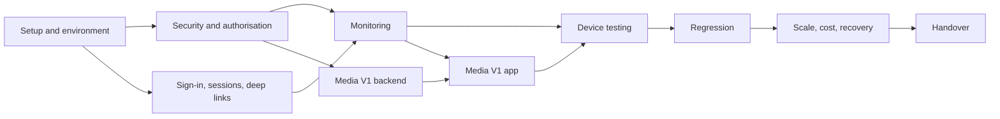

# AMARI production sprint: engineer handover

Start here. This folder is the handover for the production-readiness sprint on the AMARI mobile
app. It was prepared on 29 September 2026 by reading the repository at commit `3ce4c4c`
(`release/v2-redesign-signed`). No production system was contacted to prepare it, and it contains
no secret values.

## What AMARI is

An invitation-only membership app for an African diaspora professional community. A person
enters an invitation code, signs in with Apple, Google or an emailed code, and the server creates
their membership from the invitation. Members then have a news briefing and hand-written Pulse
editions, events with QR tickets, member matching and a project map (Aligned, gold tier and above),
introductions to project owners, and a profile. Five tiers exist: member, silver, gold, platinum,
laureate. Administrators run invitations, events, check-in, moderation and Pulse from inside the app.

## Current state

| Item | State |
|---|---|
| Stack | Expo SDK 54, React Native 0.81.5, TypeScript, expo-router, TanStack Query, Supabase (Postgres 17.6 with RLS, 65 SECURITY DEFINER functions, six Edge Functions, pg_cron, pg_net, Storage). No separate server |
| iOS | 1.2.5 build 37, live on the App Store |
| Android | 1.2.5 version code 62, Google Play closed testing ("Alpha"), never on production |
| Backend | One Supabase project. Every build profile points at it. **There is no staging environment** |
| Members | 23 active and 4 administrator roles at 22 September 2026 |
| Last production change | Invitation security containment on 22 September 2026; read `docs/SECURITY-P0-CONTAINMENT-2026-09-22.md` |
| OTA updates | Not in use; every fix ships as a store build |
| Crash reporting | None installed |
| Tests | 77 Jest tests (logic only), 15 Deno tests, 5 pgTAP files, all passing in CI. Nothing renders a screen; 1.2.5 was not tested on hardware |

## The sprint

Verify, reproduce, fix, test, harden, document. Priorities:

- P0: security and authorisation.
- P0: sign-in, invitations and sessions.
- P0 and P1: end-to-end testing on physical iOS and Android devices.
- P1: Media V1, member-only audio and video. A core deliverable; almost nothing of it exists yet.
- P1: crash and error monitoring, and release safety.
- P1 and P2: scale, cost and recovery evidence.
- Stretch: profile pictures, only after the above.

Not in scope: a rebuild, a redesign, a general refactor, a dependency upgrade, subscriptions, a
new recommendation engine, or a high-scale re-architecture. Larger problems go into the findings
register as Phase 2 with a written recommendation.

## What to know before you touch anything

- **No staging.** Any test that writes, against a deployed database, writes to production. Run authorisation work on a local Supabase built from the migrations until Jeremy decides otherwise. `SETUP.md` explains the options.
- **Redemption has no attempt limit.** The 22 September fix closed the path from stranger to admin, but `redeem_invitation_code` can be called repeatedly by anyone who creates a sign-in account, and codes are now six characters.
- **The Aligned gold gate is enforced on the map functions, not on the tables behind them.** `map_cache_*` and approved `projects` rows are readable by any signed-in account. The app reads `map_cache_projects` directly, so a fix touches client and database together.
- **RSVPs to capacity-limited events look broken.** `rsvp_to_event` appears to write no row for a first-time RSVP while returning success.
- **Media V1 is a build, not a finish.** Schema columns and a feed badge exist; `expo-av` is installed but unused; there is no upload, player, bucket or access model.

Everything above comes from reading the source. Reproduce each one before treating it as fact.

## Reading order, about 30 minutes

- This file.
- `SECURITY.md`, the reconciliation and the P0 and P1 rows.
- `docs/SECURITY-P0-CONTAINMENT-2026-09-22.md` in the repository.
- `ARCHITECTURE.md`, the section on authentication, sessions and deep links.
- `SETUP.md`, before running anything.

The rest is reference, to open when you reach that area.

## Files

| File | What it is | Update during the sprint? |
|---|---|---|
| `README.md` | This overview, first day and sprint plan | At the end |
| `SETUP.md` | Repository layout, commands, environment variables, environment options, access, test accounts | If setup changes |
| `ARCHITECTURE.md` | System design with diagrams; authentication, sessions and deep links | If the design changes |
| `SECURITY.md` | Earlier findings reconciled, current findings summary, database security inventory | Summary at the end |
| `FEATURES.md` | Every shipped feature: status, files, tables, RPCs, known issues, priority | Statuses |
| `MEDIA_V1.md` | What exists for audio and video, the decisions needed, a proposed V1 shape | Yes |
| `RELEASE.md` | iOS and Android release state, store checks, release and rollback runbook | If the path changes |
| `OPERATIONS.md` | Monitoring, cron, backups, alerting; load test plan; cost template | Yes, with results |
| `trackers/findings-register.csv` | Every finding with evidence, reproduction, status and owner | **Living** |
| `trackers/authorisation-matrix.csv` | Expected access by actor for every table, bucket, RPC and Edge Function; result column | **Living** |
| `trackers/device-test-matrix.csv` | Journeys by device and condition; result column | **Living** |
| `reference/evidence-ledger.md` | Where each claim in this folder can be checked | Add rows for new claims |
| `reference/security-definer-functions.md` | All 65 SECURITY DEFINER functions with grants, checks and test coverage | If functions change |

Finding IDs: `PR5-nn` are findings from the 5 September readiness report (the report itself is
supplied separately); `HO-nn` are new findings from this handover.

If you prefer to track findings as GitHub Issues, create one issue per row of the findings
register at the start and treat the CSV as the starting snapshot.

## First day

**Reproducible build.** `npm ci`; `npm run lint`, `npm run typecheck`, `npm run verify:security`,
`npm run test:ci`; `deno test --allow-read --no-config supabase/functions`; `supabase db start`
and `supabase test db` with CLI 2.109.1. Expected at `3ce4c4c`: 0 lint errors (27 warnings), clean
typecheck, verifier pass, 77 of 77 Jest, 15 of 15 Deno, pgTAP green.

**Environment.** Agree with Jeremy where tests that write may run. Read-only in the Supabase
dashboard, confirm: plan, backups and point-in-time recovery, whether open sign-up is enabled,
access-token lifetime, cron job names and schedules, Edge Function JWT settings, and whether a
storage bucket named `public` exists. In EAS, check whether `EXPO_PUBLIC_GOOGLE_IOS_CLIENT_ID`
is set for production.

**Reproduce the P0 findings on local Supabase**, as real `authenticated` JWTs, never the service
role: repeated `redeem_invitation_code` calls from an account with no membership (HO-04); a silver
member and a non-member reading `map_cache_projects` and approved `projects` (HO-01, HO-02); a
first-time RSVP to an event with a capacity (HO-25); a suspended administrator calling an admin
function (HO-07); a creator setting their own project to approved (HO-03). Record each result and
the exact SQL in the findings register.

**Start the authorisation matrix** with the rows exercised, and send Jeremy a short note: what
reproduced, what did not, what access is missing, and which decisions are needed.

## Sprint sequence

| Stage | Outcome | Milestone |
|---|---|---|
| Setup; security and authorisation | Reproductions; fixes as PRs with negative pgTAP tests in CI; migrations with rollback scripts for Jeremy to apply | 1 |
| Sign-in and sessions; monitoring | Sign-in rows of the device matrix; a deliberate test error visible from a release-profile build | 2 |
| Media V1 | Admin publishes audio and video; members play them on both platforms; non-members refused | 3 |
| Device testing, regression, scale and cost, handover | Filled matrices, timings, cost template, updated register | 4 |

Database fixes ship first and independently. Monitoring, the media players and any native sign-in
change should share one store build per platform, because each native release costs a review cycle.

## Inherited decisions to respect

- Membership is by invitation only. The tier rules live in the database; the app only hides navigation.
- The enforced Aligned rule is gold and above; the in-app copy says Platinum. Jeremy decides which is right.
- The news pipeline is deterministic: feeds in, one bounded classifier call per article, ranking in SQL, a hard monthly budget.
- Introductions are double opt-in; contact details appear only after approval.
- Android store builds come from the GitHub Actions workflow that injects the upload key, never from a local EAS build.
- The 22 September migrations were amended afterwards so they replay on an empty database. Production recorded them by version and will not re-run them.

## What success looks like

- Every P0 and P1 authorisation finding reproduced or disproved with real member JWTs, fixed where confirmed, and covered by a negative test that runs in CI.
- Every sign-in method, refresh, relaunch, logout and re-login exercised on a physical iPhone and a physical Android device.
- An admin publishes audio and video; a member plays them on both platforms; a non-member cannot fetch the files.
- Monitoring receives a deliberate test error from a store or release-profile build.
- All nine cron schedules in version control, or the gap documented exactly.
- The findings register separates must fix before wider launch, should fix soon, and can follow later.

## Accuracy

Production figures come from evidence captured on 21 and 22 September 2026 and from the
5 September report; they are point in time. Store and dashboard facts are marked EXTERNAL
VERIFICATION REQUIRED where they appear. Treat every finding, including those marked fixed, as
a hypothesis to reproduce.
